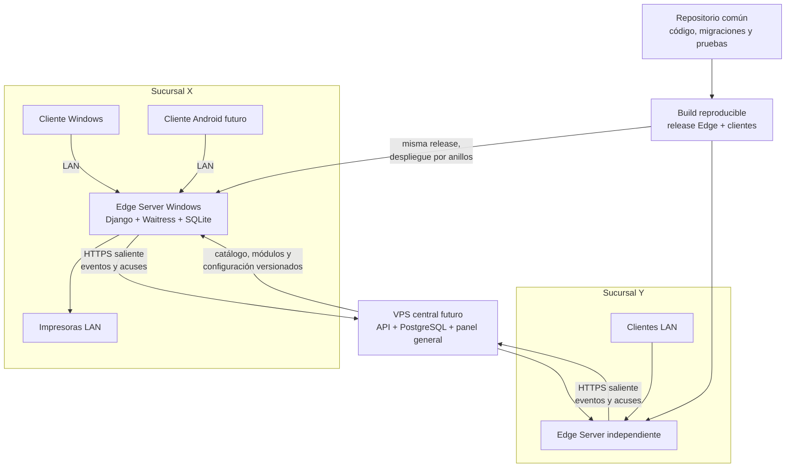

# Flujo de desarrollo, mantenimiento y clientes instalables

> Estado comprobado el 2026-09-15. Este documento describe cómo mantener y
> evolucionar el POS de Los Tocayos. Distingue capacidades existentes, cambios
> provisionales y arquitectura futura. No declara una versión base definitiva ni
> autoriza despliegues en sucursales.

## 1. Respuesta corta

El proyecto debe conservar **un repositorio y una línea común de producto**. No
se toma el código instalado en una sucursal como fuente de desarrollo y no se
mantiene una copia distinta del programa por local.

Cuando una sucursal X necesita una función nueva:

1. se parte del repositorio y de la versión soportada más reciente;
2. se reproduce la necesidad en un entorno local de desarrollo con datos de
   prueba o una copia depurada de secretos y datos personales;
3. se implementa la capacidad en el paquete común;
4. si sólo X debe utilizarla, se protege con módulo o bandera por sucursal;
5. se construye una release única, verificable e inmutable;
6. se prueba instalación limpia y actualización desde las versiones que sigan
   soportadas;
7. se instala primero en X como piloto y se habilita allí;
8. el mismo artefacto puede promoverse después a otras sucursales sin recompilar.

Una actualización ordinaria **no reinstala ni reinicia la sucursal**. Conserva
su identidad, `.env`, cuentas, catálogo, imágenes, ventas, respaldos y parámetros
locales. TeamViewer o AnyDesk pueden servir inicialmente para ejecutar una
actualización supervisada, pero no deben convertirse en el mecanismo técnico del
producto.

## 2. Arquitectura de producto



Cada Edge es autoridad de la operación inmediata de su sucursal: pedidos
abiertos, cobros, impresión y continuidad cuando Internet falla. El VPS futuro
será autoridad de catálogo maestro, módulos autorizados, publicaciones e
información consolidada. Las terminales hablan con su Edge; no dependen del VPS
para vender.

## 3. Qué es común y qué cambia por sucursal

| Elemento | Mecanismo correcto |
| --- | --- |
| Lógica, correcciones, API y esquema | Release común del servidor |
| Interfaz compartida | Frontend servido por el Edge |
| Función opcional para una sucursal | Módulo o bandera validada en UI, API y tareas |
| Productos, precios, orden e imágenes | Catálogo/versiones de datos por sucursal |
| IP, puerto, impresoras y respaldo | Configuración local protegida |
| Usuarios y PIN | Datos locales de la sucursal |
| Identidad | UUID/clave aprovisionada; no se cambia como una preferencia |
| Ventas | Base local y eventos idempotentes hacia el VPS futuro |

No se deben crear ramas permanentes como `sucursal-x`, ZIP diferentes por menú
ni modificaciones manuales dentro de `C:\LosTocayosPOS`. Una rama Git corta para
desarrollar una tarea es correcta; se integra después a la línea común.

## 4. Estado comprobado hasta este punto

### 4.1 Servidor Edge Windows

Existe y ha sido probado un recorrido de instalación local con:

- identidad explícita de sucursal;
- Python 3.13 x64 de máquina y dependencias fijadas;
- Django bajo Waitress como servicio Windows `LosTocayosPOS`;
- cuenta `LocalService`, inicio automático retardado y recuperación;
- SQLite local, migraciones y respaldo verificable antes de actualizar;
- tarea diaria de respaldo bajo `SYSTEM`;
- firewall limitado a perfil privado y subred local;
- ACL diferenciadas para código, configuración, runtime y respaldos;
- endpoint `/salud/` y verificador elevado;
- release ZIP reproducible con manifiesto y wheelhouse offline.

Se realizó una instalación limpia de la candidata A `0.4.0-dev.1` y una
actualización real a la candidata provisional B `0.4.0-dev.2`. La prueba preservó
`.env`, sucursal, 275 productos y la cuenta administrativa; aplicó la migración,
respondió HTTP 200 y auditó 11,948 rutas sin desviaciones ACL. Esto acredita el
recorrido ensayado en este equipo, no una base final ni una matriz completa de
equipos y sucursales. Una auditoría posterior confirmó un perfil POS activo y
una cuenta operativa activa no administrativa. Todavía falta aceptar manualmente
el inicio de sesión y el PIN en la interfaz.

El actualizador actual todavía es **in-place**. El código debe colocarse en la
raíz mediante un staging externo antes de ejecutar `actualizar-servidor.ps1`.
Faltan descarga integrada, firma, cambio atómico entre releases, diario
reanudable y rollback después de una migración.

### 4.2 Módulos por sucursal

La candidata B incorpora una primera implementación de:

- `Modulo` y `ModuloSucursal`;
- módulos núcleo `pos`, `catalogo`, `impresion` y `respaldos`;
- opcionales `domicilios`, `programados`, `reparto` y
  `pedidos_sucursales`;
- dependencias entre capacidades;
- configuración inicial por sucursal;
- ocultamiento o desactivación en interfaz;
- rechazo en API y omisión de tareas relacionadas.

La migración habilita las ocho capacidades en una instalación existente para no
cambiar su comportamiento. Esta implementación vive en el commit candidato
`67b43b3`; aún no se ha aceptado como base definitiva ni integrado al repositorio
principal.

### 4.3 Cliente Windows `.exe`

Existen `desktop/TocayosPOS.cs`, scripts de construcción, instalador por usuario y
configuración mediante `servidor.txt`. El ejecutable muestra el POS sin pestañas
ni barra de direcciones, pero técnicamente localiza y ejecuta `msedge.exe` con
`--app`. Por tanto:

- el usuario obtiene una ventana similar a una aplicación;
- el frontend sigue siendo el servido por el Edge;
- un cambio de interfaz del Edge aparece en los clientes sin reinstalarlos;
- el cliente depende del Microsoft Edge instalado;
- el artefacto aún no está firmado ni tiene una política de actualización madura;
- su versión `0.3.0.0` todavía no está coordinada con la versión del servidor.

El código permite generar un `.exe`; falta aceptar y certificar un paquete de
producción en los equipos destino.

### 4.4 PWA y Android

Django ya entrega dinámicamente:

- `manifest.webmanifest` para terminal y modo tableta;
- inicio en `/tabletas/`;
- presentación `fullscreen`/`standalone`;
- un service worker que guarda recursos estáticos y usa red primero.

Esto es una base PWA, pero no existe un proyecto Android, Gradle/Capacitor ni un
APK compilable. Tampoco existe enrolamiento de tabletas, firma Android, canal de
distribución ni prueba en dispositivos reales.

El service worker guarda la carcasa visual, no convierte la tableta en otro Edge:
si la red local o la computadora central fallan, no puede cobrar ni modificar la
base por sí sola. Además, los service workers y la instalación PWA requieren un
contexto seguro en navegadores modernos. El perfil actual `http://IP:8000` en la
LAN es transitorio y no basta como diseño final de instalación móvil.

### 4.5 VPS y consolidación

`EventoOutbox` ofrece una estructura local reutilizable y existe una integración
separada que importa pedidos confirmados desde `tcysPedidosSucursales`. No existe
todavía:

- API Edge-VPS;
- enrolamiento de instalaciones;
- autenticación entre Edge y central;
- inbox idempotente en el VPS;
- subida de ventas;
- catálogo o módulos publicados desde el VPS;
- panel central operativo;
- despliegue KVM 2.

La integración de pedidos existente no debe presentarse como sincronización
general del POS.

## 5. Flujo de trabajo entre desarrollador y Codex

### 5.1 Definir la tarea

El desarrollador entrega el problema y su aceptación. Un prompt útil incluye:

```text
Sucursal o grupo afectado:
Versión instalada conocida:
Módulo relacionado:
Problema o necesidad:
Flujo actual:
Flujo esperado:
Pantallas y roles afectados:
Datos o migración requerida:
Impresoras/dispositivos implicados:
Criterios de aceptación manual:
Sucursales donde se desplegará:
Ventana de mantenimiento:
```

Codex debe comenzar inventariando el repositorio, las pruebas y el estado de la
instalación. Un documento previo aporta contexto, pero la solicitud actual define
el alcance.

### 5.2 Desarrollar sin tocar producción

1. Crear una rama o worktree corta desde la versión común elegida.
2. Preparar una base de desarrollo con fixtures o datos anonimizados.
3. Reproducir el caso antes de modificarlo cuando se trata de un defecto.
4. Clasificar el cambio como código, módulo, dato o configuración.
5. Implementar la lógica y la interfaz en el repositorio.
6. Añadir pruebas de negocio, permisos, migración y compatibilidad que aporten
   evidencia real.
7. Revisar que la capacidad deshabilitada no pueda invocarse directamente.

Una copia de la base de X puede ayudar a reproducir un defecto, pero debe
depurarse y custodiarse. Nunca se toma su carpeta instalada como repositorio ni
se copian `.env`, llaves o datos de clientes a Git.

### 5.3 Construir y aceptar una release

1. Ejecutar pruebas y validadores desde un checkout limpio.
2. Revisar migraciones y compatibilidad con la versión más antigua soportada.
3. Construir una sola release reproducible.
4. Registrar commit, versión, manifiesto y hash.
5. Repetir el build y comprobar que sea idéntico.
6. Probar instalación limpia en laboratorio.
7. Probar actualización con una copia representativa de datos.
8. Ejecutar aceptación manual de interfaz, tableta e impresoras.
9. Promover exactamente el artefacto probado al canal piloto.

Codex puede implementar, construir, validar y preparar evidencia. El
desarrollador debe aprobar el comportamiento de negocio, operar hardware físico,
custodiar credenciales y autorizar el despliegue concreto.

### 5.4 Desplegar por sucursal

Para la sucursal X:

1. comprobar versión, identidad, módulos, salud, espacio y último respaldo;
2. transferir la release completa por un medio controlado;
3. verificar firma y hash cuando la firma esté implementada;
4. respaldar SQLite y configuración;
5. instalar durante una ventana de mantenimiento;
6. comprobar migraciones, servicio, salud, ACL y tarea de respaldo;
7. habilitar el módulo de X si corresponde;
8. realizar una venta, cobro e impresión de prueba según el cambio;
9. observar el piloto antes de promoverlo.

Mientras no exista el canal remoto del producto, una sesión de TeamViewer o
AnyDesk puede asistir estos pasos. Se debe ejecutar el actualizador empaquetado y
guardar un informe; no copiar archivos sueltos ni editar Python en el equipo.

## 6. Ejemplo: interfaz nueva sólo para la sucursal X

Supóngase una pantalla nueva para reparto que por ahora sólo requiere X:

1. desarrollar la pantalla y su API en el repositorio común;
2. asociarla al módulo `reparto` o a una capacidad nueva con versión mínima;
3. probar tanto `reparto=habilitado` como `reparto=deshabilitado`;
4. construir la release R una sola vez;
5. actualizar X a R y habilitar el módulo;
6. dejar Y y Z sin la capacidad activa;
7. cuando Y la necesite, actualizarla a R o a una release posterior compatible y
   habilitarla; no reconstruir R para Y.

Es válido que las sucursales mantengan versiones distintas temporalmente. No es
válido perder el inventario de versiones ni sostener indefinidamente variantes
sin soporte.

## 7. Política de versiones y soporte

Que el VPS sólo consolide ventas no elimina la compatibilidad. Una migración, un
error de seguridad, un cambio del protocolo de eventos o una corrección de cobro
pueden hacer obligatoria una actualización aunque una sucursal no solicite una
función nueva.

Se recomienda registrar al menos:

- versión del servidor Edge;
- versión de esquema/migraciones;
- versión del protocolo Edge-VPS;
- versión del cliente Windows o Android;
- versión de catálogo y configuración;
- módulos habilitados;
- fecha del último respaldo y último envío confirmado.

Clasificación de releases:

| Clase | Despliegue recomendado |
| --- | --- |
| Seguridad, integridad o cobro | Obligatoria en todas las sucursales compatibles |
| Protocolo o esquema requerido por el VPS | Coordinada dentro de una ventana definida |
| Corrección funcional común | Progresiva: piloto y luego resto |
| Función opcional | Instalar donde se necesite; activar por módulo |
| Cambio sólo de catálogo/precio | Publicación de datos, sin release de código |

Al inicio puede admitirse la versión estable y su predecesora. Antes de mantener
más generaciones se deben automatizar pruebas de actualización desde cada una.

## 8. Estrategia recomendada para `.exe` y `.apk`

### 8.1 Aclaración sobre “no usar navegador”

Hay dos objetivos diferentes:

1. **No mostrar un navegador:** se abre como aplicación, sin pestañas ni barra.
   Es compatible con reutilizar el frontend web.
2. **No utilizar ningún motor web:** exige reescribir la interfaz en tecnología
   nativa y mantener otra implementación.

Para este proyecto conviene el primer objetivo. Tanto WebView2 en Windows como
WebView en Android son motores web internos, pero el usuario utiliza un `.exe` o
un `.apk` con icono, pantalla completa y ciclo de vida de aplicación.

Una interfaz completamente nativa con Kotlin, Flutter o .NET MAUI es posible,
pero aumenta mucho el trabajo, duplica comportamiento y obliga a coordinar cada
cambio entre web, Windows y Android.

### 8.2 Windows recomendado

Evolucionar el launcher actual hacia una ventana propia con **WebView2**:

- URL del Edge configurable y restringida a orígenes autorizados;
- health check y mensajes de reconexión;
- pantalla completa/kiosco;
- bloqueo de navegación externa y descargas;
- runtime WebView2 detectado o incluido en el instalador;
- paquete y ejecutable firmados;
- telemetría local mínima y diagnóstico sin secretos.

Esto conserva una sola interfaz servida por Django y evita que el usuario vea
Edge como proceso principal, aunque WebView2 siga siendo el renderizador.

### 8.3 Android recomendado

Crear primero un piloto **Capacitor/WebView** para las tabletas reales. Hay dos
variantes:

| Variante | Ventaja | Costo/riesgo |
| --- | --- | --- |
| APK carga la interfaz remota del Edge | Una actualización del Edge actualiza la UI de todas las tabletas | Requiere LAN confiable, URL segura y manejo estricto de navegación/sesión |
| APK empaqueta el frontend y consume API del Edge | Inicio visual independiente y control de assets | Hay que versionar cliente/API, CORS/CSRF y reinstalar APK ante cambios de UI |

La primera variante encaja mejor con el diseño actual. El APK será un cliente
del Edge, no una segunda base de datos. Antes de distribuirlo faltan:

1. proyecto Android/Gradle y configuración reproducible;
2. selección o descubrimiento autenticado del Edge;
3. decisión entre HTTPS local o permiso explícito de tráfico HTTP LAN;
4. allowlist de navegación y bloqueo de enlaces externos;
5. cookies, sesión, CSRF y reconexión al reanudar la tableta;
6. modo kiosco, orientación, teclado y tamaños táctiles;
7. enrolamiento/revocación de dispositivo;
8. iconos Android correctos y splash screen;
9. keystore custodiado fuera del repositorio y firma de release;
10. procedimiento de instalación/actualización por USB-C y registro del resultado;
11. pruebas en los modelos y versiones Android reales;
12. matriz de compatibilidad APK ↔ API Edge.

### 8.4 Distribución Android inicial acordada

El flujo inicial será **sideload por USB-C desde la laptop del desarrollador**:

1. abrir y compilar el proyecto Android con Android Studio/Gradle;
2. generar un APK `release`, no distribuir builds `debug` como producto;
3. firmarlo con una keystore custodiada fuera del repositorio y respaldada;
4. conectar la tableta por USB-C;
5. instalar mediante Android Studio o `adb install -r archivo.apk`, después de
   habilitar Opciones de desarrollador/Depuración USB y autorizar esa laptop;
6. alternativamente copiar el APK y aceptar temporalmente «Instalar apps
   desconocidas» para el gestor de archivos usado;
7. configurar o enrolar la URL del Edge de la sucursal;
8. abrir el POS, comprobar sesión, reconexión, pantalla completa y una operación
   de prueba;
9. desactivar la autorización de depuración o el permiso de origen desconocido
   cuando la política de soporte no los necesite.

Se distribuirá **el mismo APK firmado** a todas las sucursales. La sucursal, IP y
módulos no se compilan dentro del APK: se configuran o enrolan. Android exige que
cada actualización use la misma firma y un `versionCode` mayor. `adb install -r`
puede conservar datos de la app, pero una migración del almacenamiento local debe
probarse expresamente.

Con la variante que carga la interfaz desde el Edge, una modificación ordinaria
de Django/HTML/CSS/JavaScript no exige reinstalar tabletas. Se genera otro APK
sólo cuando cambian el contenedor Android, permisos, política de red,
almacenamiento, plugins nativos o versión mínima de la API.

El APK evita que el operador abra Chrome, aunque internamente use Android WebView
para renderizar la interfaz. TWA es menos conveniente para la primera LAN porque
depende de HTTPS y asociación de dominio; Capacitor/WebView ofrece más control
para configuración local y ciclo de vida.

## 9. Sincronización y cierre mensual

El reporte consolidado puede ser mensual, pero conviene transmitir ventas de
forma incremental cada día o cuando haya Internet. El VPS calcula el acumulado
mensual y el Edge envía un marcador de cierre/conciliación al terminar el periodo.

Esperar hasta fin de mes para transferir todo aumenta el riesgo de pérdida,
dificulta detectar sucursales desconectadas y produce lotes grandes de errores.
Si se decide mantener una exportación mensual, ésta debe seguir siendo:

- versionada;
- firmada o autenticada;
- idempotente;
- reanudable;
- conciliable por sucursal, periodo y moneda;
- capaz de distinguir ventas, cancelaciones y ajustes posteriores.

La versión de aplicación puede variar entre sucursales si el evento publicado
mantiene un contrato compatible y el VPS conoce qué versiones acepta.

## 10. Brechas previsibles

### Antes de usar el POS en una sucursal real

- definir y aceptar la base funcional real;
- probar instalación limpia de esa base, no sólo actualización A→B;
- completar aceptación del alta de operador y recuperación de credenciales;
- probar desde otra computadora y desde tabletas reales por LAN;
- probar las impresoras físicas, desconexión, reintento y no duplicación;
- elegir HTTPS local o documentar/aislar el periodo HTTP transitorio;
- ejecutar simulacro de restauración y reemplazo de la computadora Edge;
- validar todos los flujos de venta, cobro, cancelación y corte con usuarios del
  negocio;
- definir qué catálogo inicial corresponde a cada sucursal.

### Para clientes instalables

- producir y aceptar el `.exe` final;
- decidir si se conserva el launcher de Edge o se migra a WebView2 embebido;
- firmar ejecutable e instalador;
- crear el proyecto Android y el primer APK piloto;
- resolver URL/descubrimiento del Edge, TLS, enrolamiento y actualización de
  tabletas;
- probar modo kiosco y recuperación de red.

### Para actualizaciones maduras

- recibir el ZIP directamente en staging;
- verificar firma del publicador, además del hash;
- instalar por directorios de release y cambiar de versión atómicamente;
- llevar diario reanudable y rollback compatible;
- separar migraciones reversibles de las que requieren restauración;
- reportar inventario y resultado por sucursal;
- establecer canales `development`, `pilot`, `stable` y `hotfix`.

### Para el VPS

- implementar el backend central separado del Edge;
- enrolar instalaciones y rotar credenciales;
- definir eventos de venta, inbox, acuses, cursores y conciliación;
- publicar catálogo, configuración y módulos por sucursal;
- añadir PostgreSQL, HTTPS, auditoría, respaldos externos, alertas y monitoreo;
- probar operación offline y reencuentro después de varios días.

### Operación y seguridad

- inventario de equipos, versiones y responsables;
- UPS y procedimiento ante falla de Edge;
- respaldo fuera del equipo, cifrado y restaurado periódicamente;
- rotación de secretos y cuentas de soporte;
- logs con correlación y sin datos sensibles;
- límites de retención de clientes y datos personales;
- procedimiento de soporte que no dependa permanentemente de acceso remoto
  personal.

## 11. Auditoría de limpieza y optimización

La revisión fue de inventario; no autoriza borrar datos operativos. El paquete de
release ya usa una allowlist, por lo que mocks, referencias y cachés del checkout
no se copian automáticamente al Edge.

### 11.1 Limpieza inmediata de bajo riesgo

| Hallazgo | Tratamiento recomendado |
| --- | --- |
| `__pycache__`, `*.pyc`, `.pytest_cache` | Eliminar del checkout cuando no haya procesos de prueba; ya están ignorados |
| `desktop/build`, `desktop/dist`, `desktop/release` | Regenerables; conservar sólo artefactos publicados fuera del árbol |
| `logs`, `tmp`, `staticfiles` del checkout | Regenerables; no confundir con las carpetas de la instalación activa |
| auxiliares `codex-*` | Eliminar al cerrar la sesión después de conservar evidencia útil |
| `.impeccable/questions/6cc805f3.log` | Archivo versionado vacío; retirarlo y agregar el patrón adecuado al ignore si vuelve a generarse |
| `Montserrat-Variable.ttf` y `BebasNeue-Regular.ttf` | No tienen referencias en CSS/JS; probar y retirar, conservando los `.woff2` usados; ahorro aproximado de 806 KB |

`.venv` puede recrearse desde el lock, pero eliminarla obliga a reinstalar todas
las dependencias. `.venv-roto-*` es una cuarentena: se retira sólo después de
confirmar que no se necesita para diagnóstico o recuperación.

`runtime`, `backups`, `media`, `.env`, certificados privados y logs de una
instalación real **no son basura**. Se administran mediante respaldo, retención y
un procedimiento de desinstalación, nunca mediante una limpieza del repositorio.

### 11.2 Material de diseño y documentación

- `.impeccable` contiene 25 archivos y aproximadamente 8.38 MB, principalmente
  mocks de decisiones visuales.
- `Referencias` contiene 9 archivos y aproximadamente 1.38 MB.
- Sirven como procedencia y aceptación visual, pero no pertenecen al runtime.
  Después de cerrar el diseño conviene mover la selección vigente a
  `docs/design/` y archivar las alternativas descartadas fuera del repositorio.
- `propuesta_arquitectura_pos_multisucursal.md` es un antecedente extenso y
  `docs/historico/handoffs/TRASPASO_BASE_ESTANDAR_Y_PRIMER_PARCHE.md` es un snapshot.
  Ambos se conservan bajo `docs/historico/`; el índice vigente está en `docs/README.md`.

### 11.3 Archivos que conviene modularizar

| Archivo actual | Tamaño observado | División sugerida |
| --- | ---: | --- |
| `ventas/tests.py` | 2,437 líneas | Pruebas por dominio: POS, clientes, pagos, módulos, seguridad, integración |
| `ventas/static/ventas/app.js` | 2,433 líneas | Estado/API, mesas, ticket, clientes, impresión, canales y bootstrap |
| `instalar-servicio-lan.ps1` | 1,805 líneas | Biblioteca PowerShell probada más flujos instalar/actualizar |
| `herramientas/release_servidor.py` | 1,617 líneas | Política, manifiesto, wheelhouse, build y verificación |
| `ventas/views.py` | 1,543 líneas | Vistas/API por recurso o canal |
| `ventas/services.py` | 1,102 líneas | Servicios de ticket, pago, comanda, entrega y cierre |
| `ventas/static/ventas/brand-pos.css` | 1,104 líneas | Tokens, componentes, pantallas y responsive |

La división debe hacerse por comportamiento y con pruebas existentes, no por un
número arbitrario de líneas. No conviene mezclarla con cambios funcionales
grandes ni reescribir todo a la vez.

### 11.4 Rendimiento y confiabilidad

- SQLite ya usa `timeout=20` y transacciones `IMMEDIATE`. Antes de cambiar a WAL
  o PostgreSQL local hay que simular las cinco terminales de una sucursal,
  medir bloqueos y revisar compatibilidad con respaldos/restauración.
- Waitress usa ocho hilos. Más hilos no resuelven la serialización de escritura
  de SQLite; deben medirse latencia, duración de transacciones y errores
  `database is locked`.
- La carpeta del frontend pesa aproximadamente 1.72 MB y las 25 imágenes del
  menú unos 0.54 MB; no es un problema actual. Si crece el catálogo, el service
  worker debería guardar primero una carcasa mínima y cargar imágenes bajo
  demanda. Un solo recurso faltante no debe impedir instalar el worker.
- El sondeo periódico del estado y la sincronización deben medirse con varias
  terminales antes de introducir WebSockets, Redis o Celery. La carga prevista no
  justifica complejidad sin evidencia.
- Separar código en `Program Files` y estado en `ProgramData` simplificaría ACL,
  limpieza y releases atómicas; ya forma parte del objetivo del actualizador.
- Añadir CI para pruebas, formato, migraciones, build reproducible y análisis de
  dependencias reducirá archivos accidentales y releases no verificadas.

## 12. Próximos hitos recomendados

1. Entregar el prompt y la matriz de aceptación que definirán la base funcional
   real.
2. Implementar, probar y congelar esa base en una release nueva.
3. Repetir instalación limpia y actualización desde la candidata actualmente
   instalada.
4. Construir y probar el cliente Windows en una segunda computadora.
5. Crear en Android Studio el APK piloto firmado, instalarlo por USB-C y
   probarlo contra `/tabletas/` en una tableta real.
6. Cerrar impresión física, HTTPS LAN y recuperación del Edge.
7. Implementar después el canal firmado de actualizaciones y el protocolo VPS.

La base real debe declararse sólo después de aceptación funcional y de ambos
recorridos: instalación limpia y actualización conservando datos.
